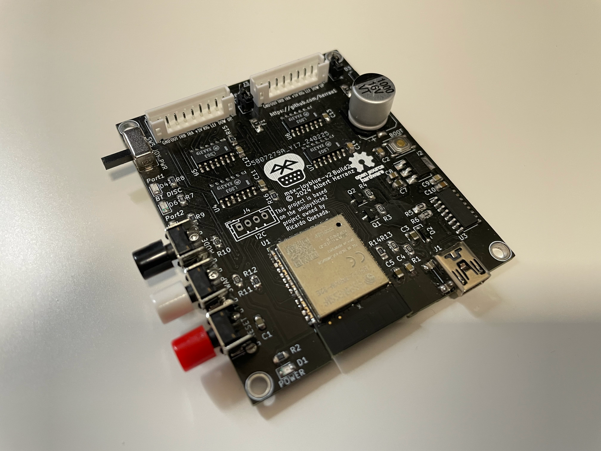

# Build Instructions

This document describes how to assemble the msx-joyblue v2 adapter.

# Assembling the msx-joyblue v2 adapter

## Bill Of Materials

| **ref**                     | **component**                      | **req_pcs** | **item_description**                                                                                                                | **item_option**                    | **pcs_per_item** | **req_items** | **link**                                                                                                                                                             |
| --------------------------- | ---------------------------------- | ----------- | ----------------------------------------------------------------------------------------------------------------------------------- | ---------------------------------- | ---------------- | ------------- | -------------------------------------------------------------------------------------------------------------------------------------------------------------------- |
| C1,C2,C4,C9,C11,C12,C13,C14 | 0805 0.1uF capacitor               | 8           | 100pcs 0805 SMD Chip Multilayer Ceramic Capacitor 0.5pF - 47uF 10pF 22pF 100pF 1nF 10nF 100nF 0.1uF 1uF 2.2uF 4.7uF 10uF 22uF       | 100nF                              | 100              | 1             | [aliexpress](https://www.aliexpress.com/item/1005005690917856.html)                                                       |
| C3,C5,C7,C8                 | 0805 22uF capacitor                | 4           | 100pcs 0805 SMD Chip Multilayer Ceramic Capacitor 0.5pF - 47uF 10pF 22pF 100pF 1nF 10nF 100nF 0.1uF 1uF 2.2uF 4.7uF 10uF 22uF       | 22UF                               | 100              | 1             | [aliexpress](https://www.aliexpress.com/item/1005005690917856.html)                                                       |
| C6                          | 10x10.5 2200uF aluminum capacitor | 1           | 10PCS 10X10.5 chip aluminum electrolytic capacitor 10V 16V 25V 35V 50V 63V 100V 100UF 220UF 330UF 470UF 680UF 1000UF                | 16V1000UF                          | 10               | 1             | [aliexpress](https://www.aliexpress.com/item/1005005475565293.html)                                                       |
| C10                         | 0805 1uF capacitor                 | 1           | 100pcs 0805 SMD Chip Multilayer Ceramic Capacitor 0.5pF - 47uF 10pF 22pF 100pF 1nF 10nF 100nF 0.1uF 1uF 2.2uF 4.7uF 10uF 22uF       | 1UF                                | 100              | 1             | [aliexpress](https://www.aliexpress.com/item/1005005690917856.html)                                                       |
| R2,R8,R9,R12,R14,R15,R16    | 0805 3.3K resistor                 | 7           | 200PCS 660PCS 720PCS 4000PCS 0402 0603 0805 1206 1210 2512 SMD Resistor Kit igmopnrq Assorted Kit 10K 100K 1K 1R 100R 220R 1% 5%    | 0805 720PCS 36Values               | 20               | 1             | [aliexpress](https://es.aliexpress.com/item/1005005671741256.html)                                                         |
| R1,R3,R4,R10,R11,R13        | 0805 10K resistor                  | 6           | 200PCS 660PCS 720PCS 4000PCS 0402 0603 0805 1206 1210 2512 SMD Resistor Kit igmopnrq Assorted Kit 10K 100K 1K 1R 100R 220R 1% 5%    | 0805 720PCS 36Values               | 20               | 0             | [aliexpress](https://es.aliexpress.com/item/1005005671741256.html)                                                         |
| R5,R6,R7                    | 0805 1K resistor                   | 3           | 200PCS 660PCS 720PCS 4000PCS 0402 0603 0805 1206 1210 2512 SMD Resistor Kit igmopnrq Assorted Kit 10K 100K 1K 1R 100R 220R 1% 5%    | 0805 720PCS 36Values               | 20               | 0             | [aliexpress](https://es.aliexpress.com/item/1005005671741256.html)                                                         |
| D2,D3                       | SOD-123 1N5819 schottky diode      | 2           | 100pcs SMD diode 0805 SOD-123 S4 1N5819 1N5819W 1N5819WS 1N5819WT SOD-323 SOD-523 1206 0603 Schottky diodes                         | SOD-123                            | 100              | 1             | [aliexpress](https://www.aliexpress.com/item/1005006207828437.html)                                                       |
| D1                          | 0805 Red Led                       | 1           | 100pcs=5colors x 20pcs 5050 5730 3014 1210 2835 3528 1206 0805 0603 0402 SMD LED Diode Kit Red / Green / Blue / White / Yellow      | Emitting Color: 0805 5colors 20pcs | 20               | 1             | [aliexpress](https://www.aliexpress.com/item/4001031824623.html)                                                             |
| D4,D5                       | 0805 Green Led                     | 2           | 100pcs=5colors x 20pcs 5050 5730 3014 1210 2835 3528 1206 0805 0603 0402 SMD LED Diode Kit Red / Green / Blue / White / Yellow      | Emitting Color: 0805 5colors 20pcs | 20               | 0             | [aliexpress](https://www.aliexpress.com/item/4001031824623.html)                                                             |
| D6                          | 0805 Blue Led                      | 1           | 100pcs=5colors x 20pcs 5050 5730 3014 1210 2835 3528 1206 0805 0603 0402 SMD LED Diode Kit Red / Green / Blue / White / Yellow      | Emitting Color: 0805 5colors 20pcs | 20               | 0             | [aliexpress](https://www.aliexpress.com/item/4001031824623.html)                                                             |
| U4,U5,U6,U7                 | 74LS03DR                           | 4           | 10pcs SN74LS00DR SN74LS02DR SN74LS04DR SN74LS05DR SN74LS08DR SN74LS14DR SN74LS32DR SN74LS03DR SN74LS05DR2 SN74LS06DR SOP-14         | SN74LS03DR                         | 10               | 1             | [aliexpress](https://www.aliexpress.com/item/1005006266817606.html)                                                       |
| U1                          | ESP32-WROOM-32E                    | 1           | 1pcs ESP-WROOM-32/32D/32U/32E WiFi Bluetooth 4.2 dual-core CPU MCU low- Bluetooth 240MHZ ESP32 chip ESP-32S                         | ESP32-WROOM-32E                    | 1                | 1             | [aliexpress](https://www.aliexpress.com/item/1005006387597679.html)                                                       |
| U2                          | AMS1117-3.3                        | 1           | 50PCS AMS1117 series AMS1117-1.2 AMS1117-1.5 AMS1117-1.8 AMS1117-2.5 AMS1117-3.3 AMS1117-5.0 SOT223 new                             | AMS1117-3.3V                       | 50               | 1             | [aliexpress](https://www.aliexpress.com/item/1005006122970723.html)                                                       |
| U3                          | CH340C                             | 1           | 10PCS Chipset CH340C CH340 SOP-16                                                                                                   |                                    | 10               | 1             | [aliexpress](https://www.aliexpress.com/item/1005006121593217.html)                                                       |
| F1,F2                       | 1206 50mA PTC fuse                 | 2           | 10PCS Self-Recoverable SMD Fuse PPTC 0805 0.05A 50MA 100MA 0.2A 0.35A 0.5A 750MA 1A 1.1A 1.25A 1.5A 2A 6V 9V 12V 16V 24V 30V 48V    | 0805 50MA 24V                      | 10               | 1             | [aliexpress](https://www.aliexpress.com/item/1005005816556049.html)                                                       |
| SW1,SW3,SW4                 | 6x6mm momentary switch right angle | 3           | 6x6mm Panel PCB Momentary Tactile Tact Mini Switch 6\*6\*4.3/5/6/7/89/10/12mm Right Angle With stent 6x6x4.3mm 5mm 6mm 7mm 8mm 9mm  | 6x6x9mm                            | 20               | 1             | [aliexpress](https://www.aliexpress.com/item/32912894177.html)                                                                 |
| SW2                         | 5.1x5.1 1pst push button           | 1           | 10PCS 3\*6 3\*4 4\*4 SMD Tactile Tact Push Button Switch 2Pin 4Pin Touch Micro Switch 3x4x2 3x6x4.3 3x6x2.5 3x6x5 4x4x1.5 4\*4\*2.5 | 4X4X1.5MM                          | 10               | 1             | [aliexpress](https://www.aliexpress.com/item/1005004067514307.html)                                                       |
| SW5                         | SK12D07G6 1P2T switch              | 1           | 10PCS SK12D07G3/4/5/6/7MM Mini Vertical Slide Switch 1P2T 3 Pin Toggle Switch SMD PCB DPDT Vertical Switch High Quality             | 6MM                                | 10               | 1             | [aliexpress](https://www.aliexpress.com/item/1005005897805728.html)                                                       |
| Q1,Q2                       | SOT-23 S8050 transistor            | 2           | SOT23 S9014 S9015 S8050 S8550 SS8050 SS8550 S9012 S9013 S9018 J3Y STY Y1 Y2 2T1 J3 J6 M6 J8 Transistor XC6206P332MR XC6206P182MR    | 50PCS S8050 J3Y                    | 50               | 1             | [aliexpress](https://www.aliexpress.com/item/1005004417008064.html)                                                       |
| JP2,JP3                     | 2.54mm pin header                  | 1           | 30PCS 40 Pin Breakable Pin Header 2.54mm Single Row Male Header Connector Kit PCB Pin Strip For Arduino                             |                                    | 30               | 1             | [aliexpress](https://www.aliexpress.com/item/1005006186853439.html)                                                       |
| J1                          | USB Mini B connector               | 1           | 10PCS Mini USB SMD 5 Pin Female Mini B Socket Connector Plug Straight DIP Jack Connector Plug-in                                    | Color: G                           | 10               | 1             | [aliexpress](https://www.aliexpress.com/item/1005004679855929.html)                                                       |
| J2,J3                       | 9pin PH2.0 straight male connector | 2           | 20sets XH 2.54mm PH2.0 Straight Right angle 2/3/4/5/6/7/8/9/10/12/14/15/16/20 pin JST Connector XHP PHR 2.5 Male Female Terminal    | Straight Type, PH2.0mm, 9P         | 20               | 1             | [aliexpress](https://www.aliexpress.com/item/1005003475317382.html)                                                       |
| \-                          | PCB                                | 1           | msx-joyblue-v2 build2c pcb                                                                                                          |                                    | 5                | 1             | [PCBWay](https://www.pcbway.com/project/shareproject/msx_joyblue_v2_build2c_caa88943.html) |

## Tools

I used the following tools and materials to assemble the msx-joyblue v2 board:

* silicone heat-resistant mat (TE-616 400x290mm)
* electronic microscope with 2 LEDs (KKmoon 3" LCD 10X-300X 3.0MP 1080P HDMI electronic digital video microscope)
* soldering station (Yihua 908D)
* T1.C "horseshoe" soldering tip (900M series)
* flux (Mechanic UV80 flux paste)
* solder (0.5mm, for hobby projects you may use 60% Sn / 40% Pb Flux 2% at your own risk)
* desoldering wick (2.5mm is fine, for correcting mistakes if you are human)

## Testing the Integrated Circuits

It is highly recommended to test the integrated circuits before soldering them, specially if you buy chips from cheap Asian stores.
Otherwise, you'll need to desolder any non-working chip after soldering them on the PCB and realizing they really doesn't work.

### CH340C

The CH340C is a SOP-16 packaged USB to serial chip that requires few external components to function, thus it is very easy to build a test circuit.

||
|:--|
|CH340C pinout|

In order to minimally test a CH340C chip we just need to connect GND, VCC, USBD+, USBD- and put a 100nF capacitor between V3 and GND, as indicated in the following diagram.

||
|:--|
|CH340C minimal test circuit|

This circuit can be easily built using the following components:
* [USB-A male to 2.54mm female dupont header cable](https://www.aliexpress.com/item/4000916333572.html)
* [SOP-16 to DIP-16 adapter](https://www.aliexpress.com/item/1005005939115495.html)
* [0.1uF ceramic capacitor](https://www.aliexpress.com/item/32973259342.html)
* [male-male jumper wires](https://www.aliexpress.com/item/1005006263457745.html)
* [breadboard](https://www.aliexpress.com/item/1005006102317693.html)

||
|:--|
|CH340C test setup|

When you have the test circuit ready, push down and hold the top of the SOP-16 to DIP-16 adapter to open the adapter pin "jaws", using precision tweezers insert and perfectly align the CH340C chip with the adapter pin "jaws" and finally release the top of the adapter to have the chip secured and correctly connected. You can now connect the USB-A cable to your computer and look for the CH340 device in the list of USB devices.

||
|:--|
|CH340C adapter correctly recognized|

To remove the chip from the SOP-16 to DIP-16 adapter you will need to push and hold again the top of the adapter, lift gently the chip using tweezers and then release the top of the adapter when it is empty.

## Board assembly instructions

### Component orientation

#### Polarized components

As always, make sure to align all the polarized components correctly:
* the aluminum capacitor has a black color zone at the top indicating the negative pad, and also the base is beveled on the positive pad which must match the footprint at the PCB
* the leds have color markings near the negative pad
* the 1N5819 schottky diodes have a strip on the negative pad
* the CH340C USB to serial chip has a dot marking near pin 1

  Pin 1 of CH340C must be aligned to the PCB footprint (depending on the footprint used) with the pin marked with a small arrow or the pin where the silkscreen line extends to the end of the pin
* the SN74LS03DR chips have a vertical line close to the side where pin 1 is, but it does NOT indicate which pin is pin 1 (pin1 is on the bottom left when you orient the chip so that the markings can be read correctly)

  Pin1 of SN74LS03DR must be aligned to the PCB footprint in the same way as described for the CH340C chip.

* PH2.0 headers must be oriented according to the PCB footprint silkscreen drawing

* The rest of polarized components (3V3 regulator, transistors, momentary mini buttons, tactile push button, sliding switch and USB mini connector) can only be installed in the correct orientation

||
|:--|
|Polarized components orientation|

#### Non-polarized components

All ceramic capacitors, resistors, fuses and pin headers are non-polarized and can be installed in any orientation.

### Soldering

You can use many different strategies and techniques to solder the components into the PCB.

You can have a look at one of the many tutorials available on youtube:

I use this technique for SMD components:
* Put flux paste/gel into the PCB pads of the footprint of the component that you want to solder.
* Place and align the component on top of its PCB footprint. The component will stick to the PCB thanks to the flux paste/gel.

  It is advisable to use precision tweezers and a microscope to make the component alignment, unless you have very good eyesight.

* Put a really small quantity of solder into the base of the T1.C tip of the soldering iron, which should be already at 350 degrees Celsius. The flux of the solder will evaporate while at the tip, but that's no problem as we will use the flux from the PCB pads.
* Hold the component with tweezers so that it does not move while soldering the first of its pads.
* Put the tip of the soldering iron with the solder so that it touches both the PCB pad and component leg. The solder at the soldering iron tip will mix with the flux at the PCB pad creating a good solder joint.

  You can move the soldering iron tip into and out of the component leg to make sure the solder makes a good metal junction.

* Repeat the process with the remaining pads. If the component has many pads, solder first two pads in opposite diagonals to secure the component, then go after the rest of the pads.
* Clean the excess of flux using pure isopropyl alcohol.

I would suggest to solder the components in decreasing difficulty order, making batches of identical valued components to avoid mistakes, also leaving for the end the taller SMD components (like the aluminum capacitor and the USB mini connector) and the through-hole components (like the PH2.0 headers, right-angled buttons and sliding switch), but do as you feel comfortable.

>[!NOTE]
> You are not required to solder the ESP32 ground pad at the bottom of the chip (this is specially relevant if you use a soldering iron to solder it).

>[!NOTE]
> After soldering it is strongly advisable to verify the continuity of all signals using a digital multimeter, with special emphasis on the ESP32 chip pins (which may not provide good contact with the pads, despite looking properly soldered).

# Preparing the joystick cables

## Bill Of Materials

| **ref**                     | **component**                      | **req_pcs** | **item_description**                                                                                                                | **item_option**                    | **pcs_per_item** | **req_items** | **link**                                                                                                                                                             |
| --------------------------- | ---------------------------------- | ----------- | ----------------------------------------------------------------------------------------------------------------------------------- | ---------------------------------- | ---------------- | ------------- | -------------------------------------------------------------------------------------------------------------------------------------------------------------------- |
| \- | 9pin PH2.0 straight female socket | 2  | 10PCS JST Plugs Sockets XH2.54/PH2.0/SH1.0/ZH1.5/JST1.25 Connectors 10/9/8/7/6/5/4/3/2 Pin connector Case Without Wire Connector | Color: Housing Case, Package: PH 2.0mm, Pins: 9P | 10  | 1 | [aliexpress](https://www.aliexpress.com/item/1005006058022917.html) |
| \- | PH2.0 pin terminals               | 18 | 500Pcs JST PH 2.0 2.0mm Metal Pins Terminal Wire Cable for Housing PH2.0 Female Socket Connector                                 |                                                  | 500 | 1 | [aliexpress](https://www.aliexpress.com/item/1005006603250204.html) |
| \- | Cable gland 5mm                   | 2  | 10pcs Cable Gland Connector Rubber Strain Relief Cord Boot Protector Wire Cable Sleeve Power Tool Cellphone Charger              | 5mm-black, China                                 | 10  | 1 | [aliexpress](https://www.aliexpress.com/item/1005005914224947.html) |
| \- | Extension cable MSX               | 2  | 1PC 9 Pin 1.5M Extension Cable For Sega Genesis 2 for MD2 Controller Gamepad                                                     | Color: as pic                                    | 1   | 2 | [aliexpress](https://www.aliexpress.com/item/1005005677059954.html) |

## Tools

I used the following tools to prepare the DE9 cables:

* wire stripper & cutter (Stanley FatMax)
* PH2.0 crimping tool (SN-01BM)

## Cable assembly instructions

Although you can use the DE9 extension cables as is, they are quite long (1.5m) for the msx-joyblue adapter: it is recommended to adjust them to about 35cm long, which requires cutting the cable, stripping again the 9 internal wires and placing a new cable gland for strain relief.

You need to crimp PH2.0 metal pins to all of the joystick cable wires. Make sure that you crimp the sleeve of the wire with the rear wings of the PH2.0 metal pin only, and that the center wings crimp the stripped copper wire. If the wire is too thin to get properly crimped, you can fold a bit the stripped copper wire at the end of the wire so that the central wings have more copper volume to crimp.

Once the PH2.0 metal pins are correctly crimped you can insert them into the PH2.0 plastic housing in the specific required order.

This is the detailed procedure to prepare each of the two DE9 cable extensions:

1. Cut the DE9 extension cable leaving about 35cm from the DE9 connector.

   TBC

2. Use the wire stripper to remove about 5cm of the cable insulation at the cut end, exposing the 9 internal wires.

   TBC

3. Insert the cable gland at the cut end of the extension cable.

   You must first insert the cable gland via its "conic" side into the 9 internal wires. From there you need to keep sliding the cable gland into the cable until the cable gland is fully inserted into the external cable insulation.
   
   You may need to use a bit of dish soap to fit the cable gland into the cable, as it fits very tight.

   TBC

4. For each one of the 9 internal wires:

   4.1. Use the wire stripper to remove about 2-3mm of the individual cable insulation

   4.2. Fold the exposed copper wire over itself at half the distance, leaving just 1-1.5mm of exposed copper cable length at the end (this is to make enough copper available to the central pin wings of the PH2.0 metal pins).

   4.3. Crimp a PH2.0 metal pin to the end of the individual cable, making sure the metal pin's center wings crimp the copper and the rear wings crimp the cable insulation.

   TBC

5. Verify with a continuity tester or digital multimeter that each wire makes a proper connection to its associated DE9 pin.

   TBC

6. Insert the continuity-verified crimped PH2.0 metal pins into the PH2.0 plastic housing.

   Looking at the plastic housing from the side where the tiny flaps are visible, and going from left to right, the order of the wires is:

   `UP, DOWN, LEFT, RIGHT, +5V, TRG-A, TRG-B, OUT, GND`

   TBC

7. At this point you can secure the cable gland using a tiny drop of glue, so that the cable gland can't move any longer.

   TBC

# Putting it all together into the acrylic enclosure

## Bill Of Materials

| **ref**                     | **component**                      | **req_pcs** | **item_description**                                                                                                                | **item_option**                    | **pcs_per_item** | **req_items** | **link**                                                                                                                                                             |
| --------------------------- | ---------------------------------- | ----------- | ----------------------------------------------------------------------------------------------------------------------------------- | ---------------------------------- | ---------------- | ------------- | -------------------------------------------------------------------------------------------------------------------------------------------------------------------- |
| \- | M3 flat head torx screw 10mm         | 8 | 10/ 20/ 50pcs Black Zinc-Plated 304 Stainless Steel M2 M2.5 M3 M4 M5 M6 CM Torx Six-Lobe Ultra Thin Flat Wafer Head Screw Bolt  | Size: M3x10mm (50pcs), Color: Black Stainles Steel | 50 | 1 | [aliexpress](https://www.aliexpress.com/item/1005004348590627.html) |
| \- | M3 nylon hex nut              | 4 | 10-50pcs DIN934 M2 M2.5 M3 M4 M5 M6 PA66 White or Black Nylon Hex Nut Hexagon Plastic Nuts Metric Thread Suit For Screws Bolts | Size: M3 50pcs, Color: Black                       | 50 | 1 | [https://www.aliexpress.com/item/32808424957.html](https://www.aliexpress.com/item/32808424957.html)           |
| \- | M3 nylon female to female 12mm hex spacer | 4 | 20/ 50Pcs M2 M2.5 M3 M4 M5 Black/ White Nylon Hex Female to Female Standoff Nylon Plastic Hexagon Thread PCB Motherboard Spacer | Size: M3 (20pcs), Length: 12mm, Color: Black       | 20 | 1 | [aliexpress](https://es.aliexpress.com/item/1005004311987482.html)   |
| \- | DINA4 acrylic 3mm sheet              | 1 | DINA4 acrylic sheet 3mm tobacco                                                                                                 |                                                    | 2  | 1 |                                                                                                                |
|    | laser cut service                    | 1 |                                                                                                                                 |                                                    | 2  | 1 |                                                                                                                |

## Tools

I used the following tools to put together the acrylic case:

* torx screwdriver (8x60)

## Enclosure assembly instructions

1. Start by inserting four screws into the bottom enclosure panel and secure them with four nuts.

2. Slide the assembled PCB board into the screws, so that it sits on top of the nuts.

3. Screw the 12mm hex spacers to the screws to hold the PCB board to the enclosure.

4. Attach the enclosure side panels.

   Note that the UP, LEFT and DOWN panels need to be attached in a specific orientation, aligning the panel holes to the accessible board elements.

5. Install the DE9 cables.

   Connect first the PH2.0 connectors, then insert the cable glands into the enclosure UP panel holes.

   You need to put the cable gland with the part with the excess rubber removed facing up so that the enclosure can be easily closed.

6. Finally, attach the TOP enclosure panel.

   Secure the TOP panel using the remaining four screws.

