# Bluetooth controller adapter for MSX (msx-joyblue) v2

[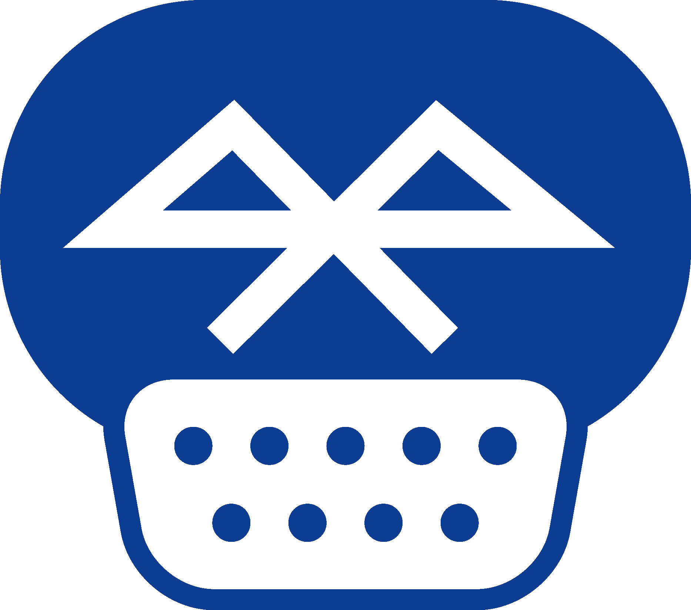](images/msx-joyblue-logo-color.png)

Connect Bluetooth controllers to [MSX computers](https://www.msx.org/wiki/)

## Introduction

The msx-joyblue is an adapter that allows connecting Bluetooth controllers to [MSX General Purpose I/O Interfaces](https://www.msx.org/wiki/General_Purpose_port) (aka joystick ports).

The adapter is based on the [unijoysticle2](https://github.com/ricardoquesada/unijoysticle2) and [bluepad32](https://github.com/ricardoquesada/bluepad32) projects, both owned by Ricardo Quesada.

The main features of the msx-joyblue v2 adapter are:
* small size
* made of widely available electronic components
* uses SMD components, so good soldering skills are needed to build the adapter
* emulates up to two MSX joysticks
* attaches to MSX computers using female standard DE9 connectors
* formally requires an external USB power supply as the adapter draws slightly more current than two MSX general purpose I/O interfaces can officially provide
* optionally, can be powered using MSX general purpose I/O interfaces without an external power supply if your MSX can safely supply enough current
* builtin leds provide information about the operation of the adapter

## [Hardware](hardware/kicad/)

The msx-joyblue v2 adapter uses an [ESP32-WROOM-32E chip](https://www.espressif.com/sites/default/files/documentation/esp32-wroom-32e_esp32-wroom-32ue_datasheet_en.pdf) to convert the Bluetooth controller actions to the [MSX joystick standard signalling](https://www.msx.org/wiki/Joystick_control).

A two-sided printed circuit board (PCB) is used to put together all components:
* The ESP32-WROOM-32E bluetooth MCU chip
* A CH340C USB to UART chip, to make it easy to upgrade firmware on the ESP32 chip
* A pair of S8050 NPN transistors to control the boot and enable signals of the ESP32 from the CH340C
* An AMS1117-3.3 regulator to convert the 5V from either the USB port or joystick ports to the 3.3V required by the ESP32 chip
* Four 74LS03 quad 2-input NAND gates with open collectors to completely mimic the standard MSX joystick behavior
* A pair of PTC fuses to minimize damage to the MSX computer in case something goes wrong with the board
* Several additional required components (diodes, leds, resistors, ceramic capacitors and an electrolytic capacitor)
* PH2.0 connectors are used to connect cable extensions
* A 2.0 pitch I2C header is added for future extensions
* Jumpers are provided to enable different power options
* A slider switch is used to enable powering the adapter from the MSX side
* Three momentary push buttons are used to reset the board, swap joysticks or change the operation mode

[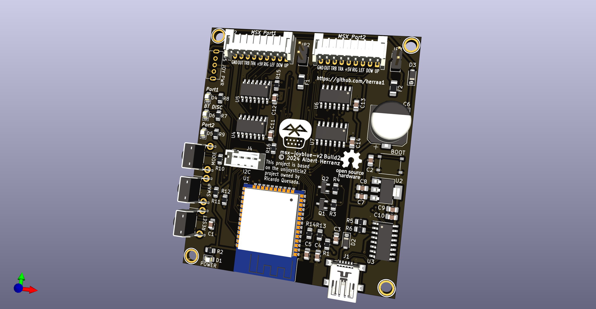](images/msx-joyblue-v2-build2-front-render.png)

Connection to the MSX general purpose I/O interfaces is implemented using DE9 joystick extension cables with a female DE9 connector on one side and a loose end on the other side.
The MSX joystick extension cable loose end is wired according to the following pinout mapping.

| [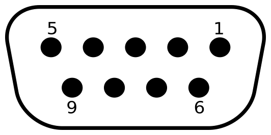](images/msx_joystick-white-bg.png) |
|:--|
| MSX joystick connector pinout, from controller plug side |

| MSX side pin | Cable color (may vary) | Signal |
| ------------ | ---------------------- | ------ |
| 5            | Brown                  | +5v    |
| 4            | Orange                 | RIGHT  |
| 3            | Grey                   | LEFT   |
| 2            | Black                  | DOWN   |
| 1            | Red                    | UP     |
| 6            | Green                  | TRIG1  |
| 7            | White                  | TRIG2  |
| 8            | Blue                   | STROBE |
| 9            | Yellow                 | GND    |

> [!WARNING]
> The msx-joyblue v2 adapter uses a different pin order on the PH2.0 header than the msx-joyblue v1 adapter.
>
> Make sure you respect the correct pin order for msx-joyblue-v2.
>

### Recommended Build

Please, use [msx-joyblue-v2 Build2c](#build2c) for making new boards.

You can find ready to order PCBs at the [PCBWay community site](https://www.pcbway.com/project/shareproject/msx_joyblue_v2_build2c_caa88943.html).

### [Build2](hardware/kicad/msx-joyblue-v2-build2)

[Bill Of Materials (BoM)](https://html-preview.github.io/?url=https://raw.githubusercontent.com/herraa1/msx-joyblue-v2/main/hardware/kicad/msx-joyblue-v2-build2/bom/ibom.html)

The Build2 adapter mimics completely the standard MSX joystick behavior:

* When pin8 is HIGH, the adapter puts all stick and triggers signals in high impedance mode irrespective of their status (as if stick and triggers were not hold in the standard MSX joystick schematic), which become HIGH on the MSX side via the MSX PSG related circuitry pull-ups (matching the expected behavior)
* When pin8 is LOW
  * if a stick direction or trigger is hold, the corresponding signal is pulled down to GND causing it to be LOW (matching the expected behavior)
  * if a stick direction or trigger is not hold, the corresponding signal is put in high impedance mode, which becomes HIGH on the MSX side via the MSX PSG related circuitry pull-ups (matching the expected behavior)

This build uses discrete logic components to honor the pin8 signaling (four [74LS03DR quad 2-input positive-nand gates with open collector outputs](https://www.ti.com/lit/ds/symlink/sn74ls03.pdf)) and uses open collector outputs which makes the adapter safer [^3] than the standard MSX joystick schematic depicted in the MSX Technical Data Book, as it avoids a series of undesired conditions that can lead to bus contention/short circuits.

||[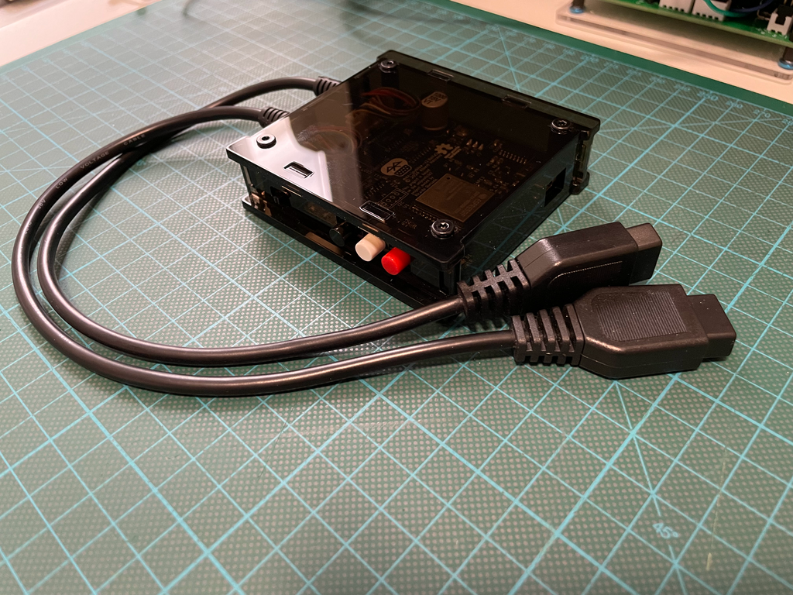](images/msx-joyblue-v2-build2-first-prototype-in-acrylic-case.png)|
|-|-|
|msx-joyblue-v2 Build2 first prototype|msx-joyblue-v2 Build2 first prototype within acrylic case|

### [Build2b](hardware/kicad/msx-joyblue-v2-build2b)

> [!NOTE]
> Build2b was never fabricated and has been marked obsolete.
>

[Bill Of Materials (BoM)](https://html-preview.github.io/?url=https://raw.githubusercontent.com/herraa1/msx-joyblue-v2/main/hardware/kicad/msx-joyblue-v2-build2b/bom/ibom.html)

The Build2b is similar to Build2 but changes slightly some silkscreen text and graphics.
 
|[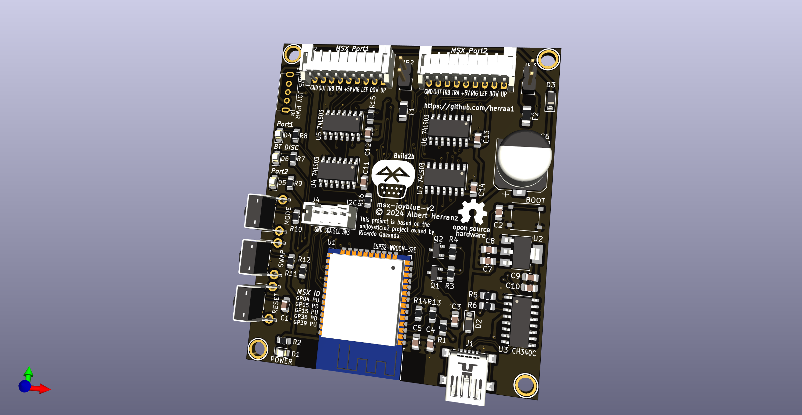](images/msx-joyblue-v2-build2b-front-render.png)|[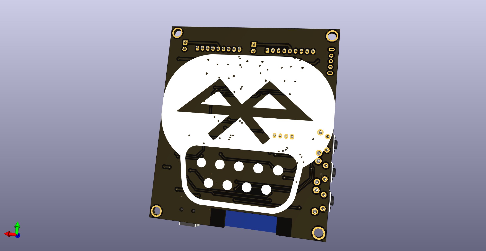](images/msx-joyblue-v2-build2b-rear-render.png)|
|-|-|
|msx-joyblue-v2 Build2b front render|msx-joyblue-v2 Build2b rear render|

### [Build2c](hardware/kicad/msx-joyblue-v2-build2c)

[Bill Of Materials (BoM)](https://html-preview.github.io/?url=https://raw.githubusercontent.com/herraa1/msx-joyblue-v2/main/hardware/kicad/msx-joyblue-v2-build2c/bom/ibom.html)

The Build2c adapter implements the following changes since Build2b:
* move capacitor C3 and resistor R1 closer to the ESP32 EN pin
* change C3 from 10uF to 22uF to give extra ramp up time to the 3V3 power rail

|[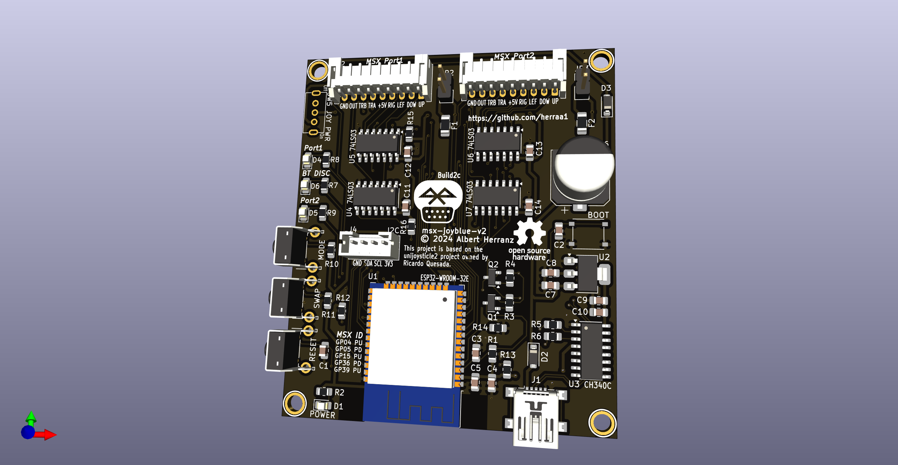](images/msx-joyblue-v2-build2c-front-render.png)|
|:--|
|msx-joyblue-v2 Build2c front render|

|[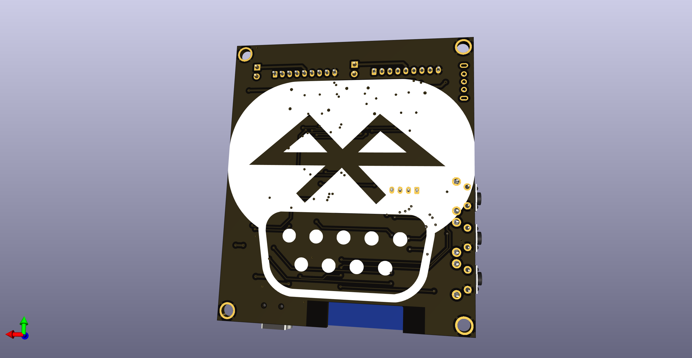](images/msx-joyblue-v2-build2c-rear-render.png)|
|:--|
|msx-joyblue-v2 Build2c rear render|

|[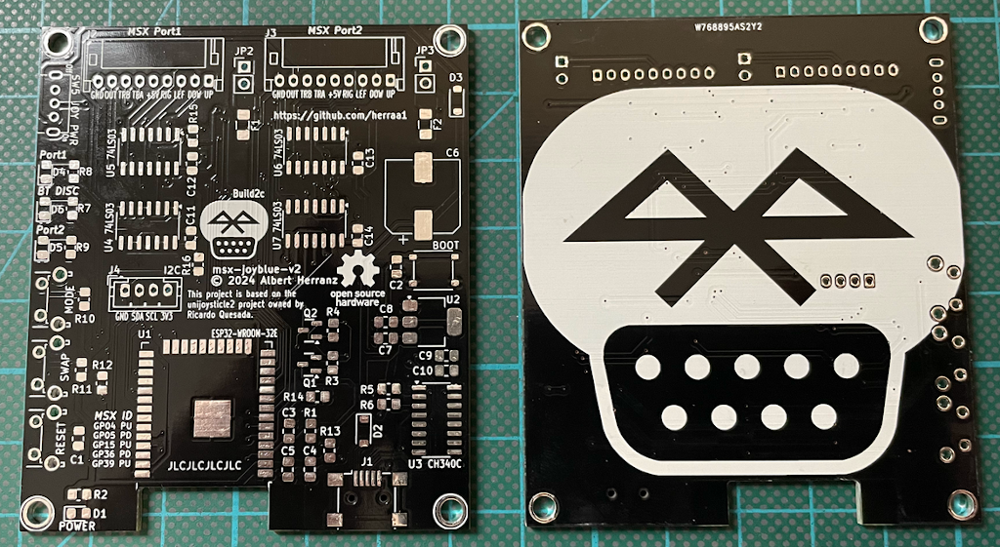](images/msx-joyblue-v2-build2c-pcbs-front-and-rear.png)|
|:--|
|msx-joyblue-v2 Build2c PCBs front and rear|

## [Firmware](https://github.com/ricardoquesada/bluepad32/tree/main)

The msx-joyblue v2 adapter firmware uses Ricardo Quesada [bluepad32](https://github.com/ricardoquesada/bluepad32/tree/main) library to drive Bluetooth controllers.
A [small modification](https://github.com/ricardoquesada/bluepad32/commit/9736bd169bc13ec625d469b8305d2ed2f46d6e69) to the library that enables support for MSX computers has been already commited to the _main_ branch.

See [bluepad32 documentation](https://github.com/ricardoquesada/bluepad32/tree/main/docs) for [supported Bluetooth controllers](https://github.com/ricardoquesada/bluepad32/blob/main/docs/supported_gamepads.md).

## [Enclosure](enclosure/)

A simple yet functional acrylic enclosure design is included.

## Powering the msx-joyblue adapter

The msx-joyblue adapter uses about ~107mA when operating, while a single MSX general purpose I/O interface is capable of delivering up to 50mA according to the MSX standard [^1].
That means that even using two MSX general purpose I/O interfaces (50mA + 50mA = 100mA) we are slightly over (107mA) the max current specification for the MSX general purpose I/O interfaces.

Thus, the safest way to power the msx-joyblue adapter is by powering it via the USB mini connector of the board using an external 5V USB power supply. The board automatically powers up when using the USB mini connector without enabling any switch.

Nevertheless, even if the MSX especification puts such a low limit on the current that can be drawn from a general purpose I/O interface, real MSX hardware usually can safely deliver enough current for the msx-joyblue adapter to work correctly without harming our beloved classic computers.

Taking that into account, the msx-joyblue adapter has been enabled to be optionally powered by the MSX general purpose I/O interfaces port 1 and port 2.

To enable powering the msx-joyblue adapter from _Port 1_ and/or _Port 2_, the switch SW5 _JOY PWR_ must be first turned on by sliding the switch handle to the right.

> [!NOTE]
> A [1N5819 SMD Schottky diode](https://www.diodes.com/assets/Datasheets/1N5819HW.pdf) D3 is used to avoid leaking current from the msx-joyblue adapter to the MSX in case the msx-joyblue adapter is powered by USB while the _JOY PWR_ switch is ON.
> Another [1N5819 SMD Schottky diode](https://www.diodes.com/assets/Datasheets/1N5819HW.pdf) D2 prevents backpowering the USB side from the MSX side.
> And two Positive Temperature Coeficient (PTC) resettable fuses F1 and F2 of 50mA each protect the MSX general purpose I/O interfaces port 1 and port 2 from excess of current in case something goes horribly wrong on the msx-joyblue adapter side.

To power the msx-joyblue adapter using the MSX general purpose I/O interfaces we must first understand how the PTC protections on the msx-joyblue adapter are implemented.

The selected PTCs are rated for 50mA which is the so called Hold Current (the maximum current that can flow in normal operation). There is also the Trip Current (the minimum current necessary for the PTC to move to high-resistance state) which for the selected PTCs is around 100mA. Those thresholds are dependent on temperature and voltage. And to make things more undeterministic, the behavior of the PTC when current is between those thresholds is undefined (it may trip or not).

In normal operation and for a room temperature of around 25 degrees Celsius, the selected PTCs in practice never trip below 75mA.

> [!NOTE]
> Depending on the exact PTCs installed, the trip current may be slightly different and the adapter may trip at a different point. Unless you buy the PTCs from a reliable source, it is very difficult to know the exact PTC specifications. 
>
> Remember that the PTCs are provided as a safeguard in case something goes really wrong on the adapter, not to act as an exact current limiter to strictly comply with the 50mA per-port MSX specification.

So **if our MSX computer can safely provide more than 50mA on each MSX general purpose I/O interface** (which is usually the case), we can connect both _Port 1_ and _Port 2_ to the MSX computer and turn on the SW5 _JOY PWR_ switch to power the msx-joyblue adapter. Note that we need to connect both ports even if we use just one Bluetooth gamepad, just to meet the power requirements.

Two jumpers JP2 and JP3 can be used to bypass the PTC protections for _Port 1_ and _Port 2_ respectively.

> [!WARNING]
> Bypassing the PTC protections may damage your MSX computer.
> Do not bypass the PTC protections unless you known what you are doing.

By closing JP2 (and/or JP3) and **if our MSX computer can safely provide more than 100mA on a single MSX general purpose I/O interface**, we can connect _Port 1_ (or _Port 2_) to the MSX computer and turn on the SW5 _JOY PWR_ switch to power the msx-joyblue adapter using a single joystick port.

In summary, we can use the following options to power the msx-joyblue adapter (from safest to less safe):
* via the board USB mini conector
  * leave open jumpers JP2 and JP3
  * turn off the SW5 _JOY PWR_ switch
  * connect a 5V USB power supply to the board USB mini connector
* via two MSX general purpose I/O interfaces, if your MSX can safely provide slightly more than 50mA on each MSX general purpose I/O interface
  * leave open jumpers JP2 and JP3
  * turn on the SW5 _JOY PWR_ switch
  * connect both _Port 1_ and _Port 2_ to the MSX general purpose I/O interfaces
* via one MSX general purpose I/O interface, if your MSX can safely provide more than 100mA on each MSX general purpose I/O interface
  * close jumpers JP2 and/or JP3
  * turn on the SW5 _JOY PWR_ switch
  * connect _Port 1_ or _Port 2_ to a MSX general purpose I/O interface

## Switches and Buttons

[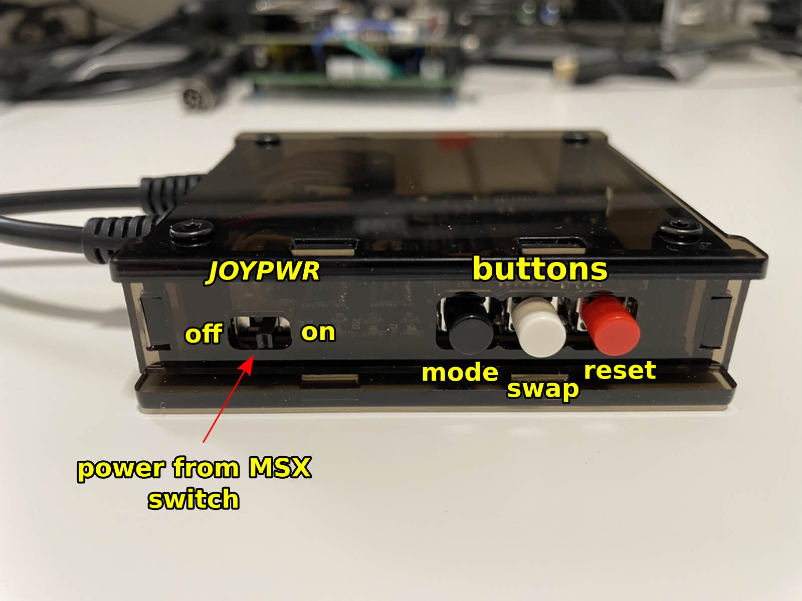](images/msx-joyblue-v2-build2-buttons.png)

| **Switch** | **State**      | **Description**                                                          |
|------------|----------------|--------------------------------------------------------------------------|
| _JOYPWR_   | Off            | power from MSX computer via joystick port(s) is off (except logic gates) |
| _JOYPWR_   | On             | board electronics get power from MSX computer via joystick port(s)       |

> [!NOTE]
> If you plug a +5V USB power supply to the USB mini connector, the adapter will turn on unconditionally irrespective of the _MSXPOWER_ switch position.
>

| **Button**   | **Description**                                                                             |
|--------------|---------------------------------------------------------------------------------------------|
| MODE         | change the [operation mode](https://github.com/ricardoquesada/unijoysticle2/blob/main/docs/user_guide.md#unijoysticle-buttons-and-leds) of the connected gamepad between "basic mode" and "twin stick mode" |
| SWAP         | swap connected gamepads between MSX joystick ports                                          |
| RESET        | restart the firmware, gamepads get disconnected                                             |

## LED indicators

[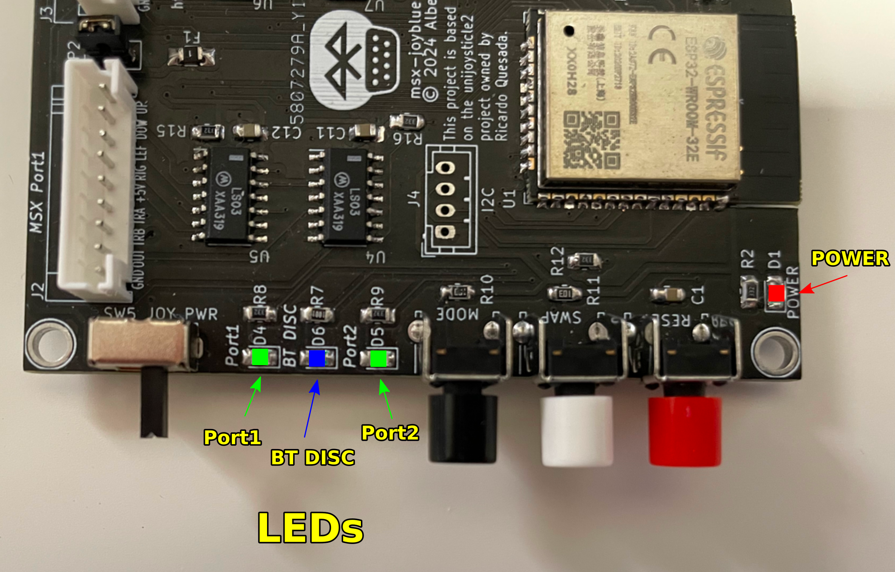](images/msx-joyblue-v2-build2-leds.png)

| **LED**   | **State**      | **Indication** |
|-----------|----------------|---------------|
| _POWER_   | Off            | board is not receiving 3V3 power |
| _POWER_   | Solid Red      | board is receiving 3V3 power     |
| _Port1_   | Off            | no gamepad is controlling _Port 1_ |
| _Port1_   | Solid Green    | a connected gamepad is controlling _Port 1_ |
| _Port1_   | Blinking Green | Every 1sec, PTCs are tripping, see [Troubleshooting](#troubleshooting) |
| _Port2_   | Off            | no gamepad is controlling _Port 2_ |
| _Port2_   | Solid Green    | a connected gamepad is controlling _Port 2_ |
| _BT DISC_ | Off            | Bluetooth discovery is off, no new connections are accepted, existing connections (if any) stay on |
| _BT DISC_ | Solid Blue     | Bluetooth discovery is on, new connections are accepted, both "connects" and "re-connects" are accepted |

See also the [Unijoysticle user guide](https://github.com/ricardoquesada/unijoysticle2/blob/main/docs/user_guide.md#unijoysticle-buttons-and-leds), keeping in mind that led colors are slightly different.

## Troubleshooting

**Q: Just after powering the board _POWER_ led is solid red, _Port2_ and _BT DISC_ leds are off and the _Port1_ led is solid green, but the adapter does not work**

**A:** Press the reset button to reinitialize the adapter, the _BT DISC_ led should go solid blue shortly, when the adapter is ready.

**Q: I did the reset, but now the _Port1_ led blinks every second, the _BT DISC_ led is off and the _Port2_ is solid green but the adapter does not work**

**A:** The PTC fuses are tripping preventing the adapter to properly work. See the [Powering the msx-joyblue adapter](#powering-the-msx-joyblue-adapter) section: use a USB power supply or install the fuse bypass jumpers.

**Q: The _BT DISC_ led went off, what happened?**

**A:** You either have 2 gamepads already connected or have turned on the [_Twin Stick_ mode](https://github.com/ricardoquesada/unijoysticle2/blob/main/docs/user_guide.md#twin-stick-mode-aka-enhanced-mode).

This can happen too if the PTC fuses are tripping (see previous question).

**Q: My Wiimote does not connect**

**A:** If the adapter was previously connected, try pushing any Wiimote button until the Wiimote connects. If that does not work, open the battery compartment and press the red _SYNC_ button to pair the Wiimote with the adapter.

## Compatibility Tests

| **Model**                | **Adapter PCB v2 Build2** | **Adapter PCB v2 Build2c** |
|--------------------------|---------------------------|----------------------------|
| Sony MSX HB-101P         |          OK               |           OK               |
| Sony MSX HB-501F         |          OK               |           OK               |
| Toshiba MSX HX-10        |          OK               |           OK               |
| Philips MSX2 VG-8235     |          OK               |           OK               |
| Panasonic MSX2+ FS-A1WSX |          OK               |           OK               |
| Omega MSX2+              |          OK               |           OK               |
| MSXVR                    |          OK               |           OK               |

## Build Instructions

Follow these [Build instructions](Build.md) in order to assemble the msx-joyblue v2 adapter.

## References

Ricardo Quesada bluepad32 library
* https://github.com/ricardoquesada/bluepad32

Ricardo Quesada Unijoysticle2 project
* https://github.com/ricardoquesada/unijoysticle2

MSX general purpose I/O interface
* https://www.msx.org/wiki/General_Purpose_port

[^1]: https://www.msx.org/wiki/General_Purpose_port
[^2]: https://www.msx.org/wiki/MSX-HID
[^3]: https://www.msx.org/wiki/Joystick/joypad_controller (see "Undesired Conditions")

## Image Sources

* https://www.oshwa.org/open-source-hardware-logo/
* https://en.wikipedia.org/wiki/File:Numbered_DE9_Diagram.svg
* https://commons.wikimedia.org/wiki/File:Bluetooth.svg
